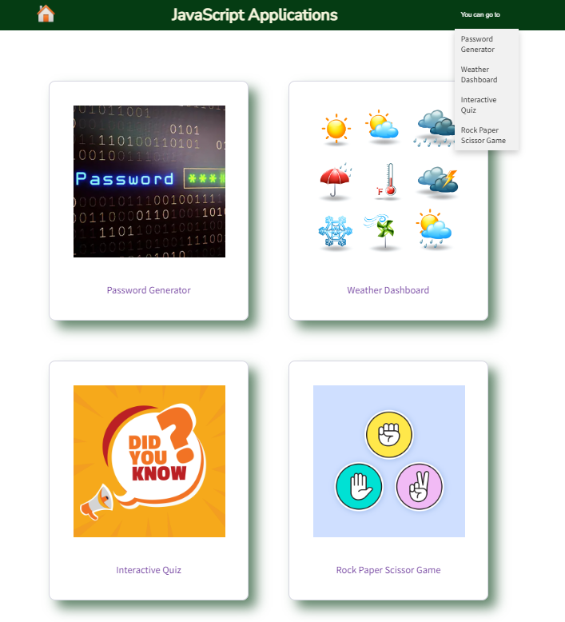

# JavaScript-Applications

[To visit my JavaScript-Applications App]( https://ajilakj.github.io/JavaScript-Applications/)

## Description
It is a website contains 4 applications using JavaScript. 
1. Password geerator: User can enter password length from 8 to 25. They can decide their password contains lowercase / uppercase/ numbers/ special chaacters
2. Weather dashboard: It is an app to help get current and next 5 days weather information when user enter a city name
3. Interactive JavaScript quiz: A quiz based on Javascript. You can select answer from the 4 options
4. Rock, Paper Scissor game: User can play this game against computer

## Installation
N/A

## Usage
- To use this website you can either select one card from home page or select one link from top right corner
- Then you will redirect to JavaScript applications pages

